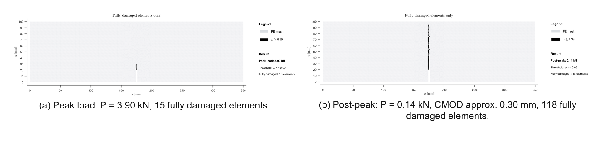

# Summary

`FRACMATH` is an open-source MATLAB framework for finite element simulation of damage in quasi-brittle materials. It uses scalar isotropic continuum damage mechanics (CDM) built on the modified von Mises equivalent strain measure [@deVree], exponential softening, and crack band regularization through a characteristic crack-band length [@bazant_oh; @oliver1989]. Quasistatic loading is solved with a modified Newton--Raphson scheme that uses a secant tangent and refactors the free-degree-of-freedom stiffness block once per load step, all under displacement control.

The package comes with three validated cases. The main benchmark is a notched two-dimensional three-point bending (3PB) test of a concrete beam with depth $D=100$ mm and notch ratio $a/D=0.2$, run in MATLAB and checked against Abaqus/Standard with a UMAT. Because a fixed-direction crack-band length introduces mesh bias when the crack plane is not aligned with the mesh, both implementations use Oliver's projected characteristic length, recomputed from the local principal strain direction at each integration point, so the dissipated energy stays tied to the local crack direction rather than to a fixed mesh direction. Two more validation cases run in MATLAB only: a three-dimensional mixed-mode Nooru-Mohamed test and a three-dimensional notched beam torsion test.

Source code, documentation, and benchmark inputs live at <https://github.com/Jaykumar9033/FRACMATH> under the MIT license.

<!-- TODO before submission: add the archived software DOI after making a tagged release and depositing the repository on Zenodo or another archive. -->

# Statement of need

CDM with crack-band regularization is among the simplest ways to run finite element simulations of damage in concrete material and rock at the structural scale [@bazant_planas]. Two mature tools in everyday research use are Abaqus driven by a UMAT or VUMAT subroutine that the user writes [@abaqus] and the C++ research code OOFEM [@oofem]. Both work well. Both also take real effort to learn for graduate students and engineers who do not already write Fortran or modern C++. Adapting either one to a new equivalent strain measure or an unusual arc-length scheme can take weeks of setup before the first curve worth reviewing appears.

MATLAB sits in nearly every engineering curriculum. It ships a sparse direct solver that holds its own against anything else on small and medium problems [@umfpack], along with a profiler and a debugger that most students already know. What has been missing is a complete damage mechanics package that installs with no configuration, handles both 2D and 3D meshes, and can be checked against an Abaqus UMAT on a standard 3PB benchmark.

`FRACMATH` fills this gap. The intended readers are graduate students and early-career researchers who need to run damage simulations quickly, without the setup burden and steep learning curve typically associated with UMAT/VUMAT or C++ research codes.

# State of the field

Existing finite element research and production tools already support nonlinear mechanics, but their use cases differ from the goal of `FRACMATH`. Abaqus/Standard is a mature commercial solver, but new continuum damage formulations usually require user subroutines, preprocessing scripts, and careful state-variable management [@abaqus]. OOFEM is a flexible open-source C++ research code, but extending it requires familiarity with its object-oriented architecture and build system [@oofem]. CALFEM is popular for teaching finite element concepts in MATLAB, but it carries no damage models and no crack-band regularization [@calfem].

`FRACMATH` was built rather than contributed into one of these larger projects because its scholarly goal is different: it provides a compact, transparent, and vectorized MATLAB reference implementation for crack-band-regularized CDM in 2D and 3D. To our knowledge, no other open-source MATLAB package offers a complete damage solver with crack band regularization in both 2D and 3D together with a documented Oliver-matched Abaqus UMAT comparison for a standard 3PB benchmark.

# Software design

The formulation is standard, so we list only the key pieces here; the full derivations are in the manual.

A scalar damage variable $\omega \in [0,1]$ degrades the elastic stiffness,

\begin{equation}
  \boldsymbol{\sigma} = (1-\omega)\,\mathbb{C}_0:\boldsymbol{\varepsilon},
  \label{eq:stress}
\end{equation}

where $\boldsymbol{\sigma}$ is the Cauchy stress, $\boldsymbol{\varepsilon}$ the small-strain tensor, and $\mathbb{C}_0$ the elastic stiffness tensor of the undamaged material. The history variable

\begin{equation}
  \kappa(t)=\max_{\tau\le t}\tilde{\varepsilon}(\tau)
  \label{eq:kappa}
\end{equation}

tracks the largest equivalent strain $\tilde{\varepsilon}$ ever reached up to time $t$, so damage cannot heal. The equivalent strain follows the modified von Mises measure of @deVree,

\begin{equation}
\tilde{\varepsilon} = \frac{k-1}{2k(1-2\nu)}I_1
  + \frac{1}{2k}\sqrt{\left(\frac{k-1}{1-2\nu}\right)^2 I_1^2
  + \frac{12k}{(1+\nu)^2}J_2},
  \label{eq:eq-strain}
\end{equation}

where $k = f_c/f_t$ is the ratio of compressive ($f_c$) to tensile ($f_t$) strength, $\nu$ is Poisson's ratio, $I_1 = \mathrm{tr}(\boldsymbol{\varepsilon})$ is the first invariant of the strain tensor, and $J_2 = \tfrac{1}{2}\,\boldsymbol{e}:\boldsymbol{e}$ is the second invariant of the deviatoric strain $\boldsymbol{e} = \boldsymbol{\varepsilon} - \tfrac{1}{3}I_1\mathbf{I}$.

Softening is exponential,

\begin{equation}
  \omega(\kappa) = 1 - \frac{\kappa_0}{\kappa}
    \exp\!\left[-\frac{\kappa-\kappa_0}{\varepsilon_f - \kappa_0}\right],
  \label{eq:soft}
\end{equation}

where $\kappa_0 = f_t/E$ is the damage-initiation threshold ($E$ is Young's modulus), and $\varepsilon_f$ is a softening parameter calibrated for each element so that the dissipated energy per unit fracture area equals the mode-I fracture energy $G_F$. Crack band regularization scales this softening branch to the element size so that

\begin{equation}
  G_F = h\,g_f
  \label{eq:cb-energy}
\end{equation}

holds whatever the mesh refinement [@bazant_oh], where $h$ is the element characteristic length and $g_f$ is the volumetric fracture energy density obtained from integrating the softening law. In the MATLAB implementation, $h$ comes from Oliver's projected crack-band length [@oliver1989], computed from the element geometry and the local principal strain direction at each integration point. For a three-node triangle, the projected bandwidth is evaluated as

\begin{equation}
  h(\mathbf{n}) =
  \frac{2}{\sum_{a=1}^{3}|\nabla N_a \cdot \mathbf{n}|},
  \label{eq:oliver-t3}
\end{equation}

where $\mathbf{n}$ is the unit vector in the maximum principal strain direction at the integration point, and $\nabla N_a$ is the spatial gradient of the linear shape function $N_a$ associated with node $a$ of the triangle, so $\sum_a |\nabla N_a \cdot \mathbf{n}|$ measures how quickly $\mathbf{n}$ traverses the element. The same projection idea is used for the 2D triangles and the 3D tetrahedra, so the dissipation stays tied to the local crack direction rather than to a fixed mesh direction.

For the Abaqus/Standard comparison of the 2D CPS3 (Continuum Plane Stress, three-node linear triangle, Abaqus designation) model, the same T3 (linear, three-node triangular finite element) formula in Equation \ref{eq:oliver-t3} is used. An Abaqus UMAT does not receive the complete element nodal geometry in the same convenient form as the MATLAB element routine, so the Abaqus preprocessing script writes the element shape-function gradients to `oliver_t3_gradN.dat`. The UMAT reads this table and recomputes $h(\mathbf{n})$ from the current maximum principal strain direction at each material point. Therefore, the updated Abaqus comparison uses the same direction-dependent Oliver bandwidth formula as the MATLAB solver, rather than using the Abaqus characteristic element length `CELENT` as the crack-band length.

Each load step is solved with a modified Newton--Raphson scheme. At a prescribed displacement increment, the solver assembles a secant stiffness from the current damage state, factors the free-degree-of-freedom block once, and reuses that factorization during the equilibrium iterations. After the displacement correction converges, stresses, strains, and damage variables are updated for all elements at once: shape-function gradients, strain components, equivalent strain, the history variable $\kappa$, and the new damage $\omega$ are all computed in batched element-wise matrix operations through `pagemtimes`, so the per-step constitutive work scales as a single sparse matrix product instead of an element loop. The damaged stiffness is then reassembled for the reaction force and for the next load step. Linear systems go through MATLAB's `\` operator, which dispatches to UMFPACK [@umfpack].

# Research impact statement

`FRACMATH` provides a reproducible MATLAB workflow for crack-band-regularized continuum damage mechanics and includes benchmark cases that exercise the same constitutive routine in planar mode-I fracture, fully three-dimensional mixed-mode cracking, and torsion-driven crack-surface rotation. Its main near-term research impact is as a transparent reference implementation for graduate researchers who need to test damage-model changes before moving to a larger production solver or a user-material implementation.

## Benchmark 1: Notched 2D three-point bending

The specimen is a concrete beam following the Grégoire geometry [@gregoire2013]: depth $D = 100$ mm, support span $S = 250$ mm, so $S/D = 2.5$, two overhangs of $0.5D$ each, and an overall length of $350$ mm. The out-of-plane thickness is $50$ mm. A single vertical notch is placed at midspan with an initial notch depth $a_0 = 0.2D = 20$ mm and a notch width of $D/40 = 2.5$ mm. The geometry, mesh, and boundary conditions are shown in Figure \ref{fig:b1-mesh-abq}. The material is concrete with $E = 37{,}000$ MPa, $\nu = 0.20$, $f_t = 3.5$ MPa, $f_c = 35.0$ MPa, and $G_F = 0.090$ N/mm.

The mesh consists of CPS3 elements, i.e., three-node linear plane-stress triangles. The same Abaqus-generated mesh is used by both solvers. It is a free triangular mesh with local refinement in a rectangular zone of width $D/2$ and height $D$ centred on the notch. The final mesh contains 14,268 CPS3 elements and 7,319 nodes, corresponding to 14,638 in-plane displacement degrees of freedom in the MATLAB run. Load is applied under displacement control at the three top-edge nodes nearest midspan, with a final vertical displacement of $-0.2$ mm. The left support is pinned, the right support is a roller, and the crack mouth opening displacement (CMOD) is computed as the horizontal displacement difference between the two node sets on the notch mouth at $y=0$.

For a fair timing comparison, MATLAB was run in single-thread mode and the Abaqus workflow script was configured with one CPU. The single-thread configuration is used here only so that the two implementations can be compared on equal footing; it is not a limitation of `FRACMATH`, which can also run multi-threaded through MATLAB's built-in BLAS, the threaded UMFPACK back end, and `parfor` workers around the element-loop helpers. The timing values reported below were measured on the development workstation: a Dell Precision 3660 desktop running Windows 11 (64-bit), with a 13th Generation Intel Core i9-13900 processor (24 cores / 32 threads, 2.00 GHz base clock), 64 GB of system RAM, and a 1 TB NVMe SSD; MATLAB R2024a was used for the `FRACMATH` runs and Abaqus/Standard 2023 was used for the UMAT comparison.

{ width=100% }

The simulated MATLAB peak load is 3.90 kN (3904 N) at a CMOD of about 0.026 mm. The full load--CMOD response is shown in Figure \ref{fig:b1-results}. The MATLAB and Abaqus curves agree closely up to peak load. The two post-peak branches are similar in shape but not identical; the remaining differences are attributed to the different global solution procedures, convergence paths, increment histories, and state-variable update order in MATLAB and Abaqus.

{ width=100% }

{ width=95% }

For an Oliver-matched check on the crack location and width, the same case was also run in Abaqus/Standard using the updated UMAT. The Abaqus damage variable is stored as SDV2 and is plotted on the undeformed mesh in Figure \ref{fig:b1-mesh-abq}. The black band corresponds to elements with $\omega \ge 0.99$, which is the same threshold used in the MATLAB damage figures. With the same mesh, same constitutive law, and same direction-dependent Oliver bandwidth formula, the relevant comparison is the predicted crack path, peak response, and post-peak load--CMOD trend.

The wall-clock breakdown of the MATLAB run is given in Table \ref{tab:walltime}.

| Component | Time (s) | Share |
|---|---:|---:|
| Stiffness assembly | 86.42 | 83.2% |
| Damage update | 2.69 | 2.6% |
| Linear solve (UMFPACK) | 7.92 | 7.6% |
| Other (bookkeeping, output) | 6.87 | 6.6% |
| **Total wall clock** | **103.90** | **100%** |

Table: MATLAB wall-clock breakdown for the 2D 3PB case ($D=100$ mm, $a/D=0.2$). \label{tab:walltime}

Stiffness assembly takes most of the run at about 83%, the linear solve under 8%, the damage update under 3%, and the rest goes to bookkeeping and output. For this problem size the sparse direct solve is cheap, so the per-element constitutive update, crack-band length calculation, and sparse assembly dominate the MATLAB wall-clock cost.

The Abaqus comparison uses the same geometry, mesh, material constants, loading, boundary conditions, scalar CDM law, modified von Mises equivalent strain, exponential softening law, and crack-band energy scaling as the MATLAB solver. In the updated Abaqus workflow, the UMAT no longer uses the Abaqus characteristic element length `CELENT` as the crack-band length. Instead, the preprocessing script writes the T3 shape-function gradients to `oliver_t3_gradN.dat`, and the UMAT computes Oliver's direction-dependent projected bandwidth from the current maximum principal strain direction using Equation \ref{eq:oliver-t3}. Therefore, the Abaqus run is described as an Oliver-matched UMAT comparison, not as a `CELENT` crack-band comparison.

The two implementations should still not be described as bitwise identical. MATLAB and Abaqus use different global solution procedures, increment control, convergence checks, floating-point operation order, and state-variable update paths. Therefore, small differences may remain in the peak load, post-peak branch, and residual tail even when the same Oliver bandwidth formula is used.

Figure \ref{fig:b1-results} compares the wall-clock cost of the two runs. Using the measured wall-clock values in Table \ref{tab:abqcompare}, MATLAB finishes the same benchmark about 13 times faster than the Abaqus/Standard UMAT workflow, and the pie chart shows that MATLAB time is dominated by assembly rather than by the sparse linear solve.

| Quantity | MATLAB | Abaqus + UMAT | Ratio |
|---|---:|---:|---:|
| Peak load (kN) | 3.90 | 3.84 | 1.017 |
| CMOD at peak (mm) | 0.0257 | 0.0263 | 0.977 |
| Wall clock time (s) | 103.90 | 1356.20 | 0.077 |

Table: MATLAB vs. Abaqus on the 2D 3PB case using the same geometry, mesh, material constants, displacement loading, boundary conditions, scalar CDM law, and direction-dependent Oliver T3 crack-band bandwidth. Both runs were configured for one CPU thread. \label{tab:abqcompare}

## Benchmark 2: 3D Nooru-Mohamed mixed-mode test

The Nooru-Mohamed specimen is a square double-edge-notched concrete panel, $200 \times 200 \times 50$ mm, with two horizontal notches 25 mm long cut from opposite edges at mid height [@nooru1992]. The two notches leave a central ligament that is loaded in a combination of in-plane shear and tension, so its tips experience a genuinely mixed-mode stress state rather than the pure mode-I opening of the three-point bending test. We follow load path 4a: a vertical (mode-I) displacement is prescribed on the top edge while a proportional horizontal (shear) displacement is imposed on the side edges, with a shear-to-tension ratio $\gamma = 0.6$, and the bottom edge held fixed. Both components are ramped together under displacement control over 900 increments to a top displacement of 0.5 mm. The material is concrete with $E = 29{,}000$ MPa, $\nu = 0.20$, $f_t = 3.0$ MPa, $G_F = 0.110$ N/mm, and $k = f_c/f_t = 10$, so $f_c = 30$ MPa.

![Nooru-Mohamed benchmark: (a) the 2D boundary conditions, (b) the 3D tetrahedral mesh through the central ligament, and (c) the experimentally observed front- and rear-face crack paths reported by Nooru-Mohamed [@nooru1992] for load path 4a, with notches at D--A and C--B. The experimental crack curves from one notch tip to the opposite notch tip across the ligament, which is the pattern the simulation is expected to recover. \label{fig:b2-mesh}](images/fig_b2_mesh.png){ width=100% }

{ width=95% }

<!-- TODO: add a results table (peak load, comparison with Nooru-Mohamed experimental data) before submission. -->

The panel is discretized in full 3D with four-node linear tetrahedral elements (TET4), refined through the ligament between the two notches where the cracks form and eventually interact; the geometry and the boundary grips are shown in Figure \ref{fig:b2-mesh}. The solver is the same vectorized modified Newton--Raphson used for Benchmark 1: a secant stiffness is assembled from the current damage state at the start of each load increment and its factorization is reused during the equilibrium iterations. The same modified von Mises constitutive routine is used, so nothing in the material model changes between 2D and 3D. The history variable $\kappa$ is committed once per converged increment, which keeps the secant system well conditioned as the two bands localize and compete for the same ligament. Crack band regularization uses Oliver's projected characteristic length for each tetrahedron. Figure \ref{fig:b2-damage-evolution} traces the predicted response from the first localization at the notch tips (increment 29) through to full coalescence of the two bands (increment 900); only elements with $\omega \ge 0.95$ are shaded, so the crack path itself stands out from the diffuse process zone around it. The two curved bands and their final separation reproduces the experimentally observed mixed-mode crack pattern, which confirms that the scalar damage model with crack band regularization carries over from the planar mode-I case to a fully three-dimensional mixed-mode setting without any change to the constitutive routine.

## Benchmark 3: 3D notched beam torsion

Brokenshire's torsion test [@jefferson_torsion] uses a $400 \times 250 \times 100$ mm plain concrete beam with a diagonal notch cut through the thickness (depth 25 mm, width 5 mm) across the bottom face at midspan. In the physical test three supports sit at the bottom corners and one end of the top edge, and a single point load goes on the remaining top corner, so the beam is twisted and the plane of maximum principal tension turns in space around the notch front, lining up with no face of the mesh. The experimental fracture pattern recovered from the broken specimen is reproduced in Figure \ref{fig:b3-mesh}: the two halves expose a single curved fracture surface that initiates at the notch front and twists around the beam axis toward the loaded corner, which is the pattern that the simulated damage field has to recover.

{ width=100% }

{ width=100% }

In the model the loaded end is driven directly: one end face is fully fixed while the opposite end face is given a prescribed rigid-body twist $\theta$ about the beam axis under rotation control, ramped to $\theta_{\mathrm{end}} = 3.0\times10^{-3}$ rad over 140 increments. The reaction torque is recovered from the twisted end, and an equivalent applied load follows from the lever arm $a = 100$ mm.

The material is plain concrete with $E = 35{,}000$ MPa, $\nu = 0.20$, $f_t = 3.0$ MPa, $G_F = 0.080$ N/mm ($= 80$ N/m), $\kappa_0 = 6.0\times10^{-5}$, and $k = f_c/f_t = 10$, so $f_c = 30$ MPa. Softening is exponential, as in the other benchmarks, with the softening parameter scaled element by element through the crack band length.

The mesh is built from four-node linear tetrahedral elements (TET4) with a refined layer around the notch front. The equivalent strain is the same modified von Mises measure used throughout, and the damage update is under-relaxed with a factor of 0.35 to keep the staggered fixed-point iteration stable through the steep post-peak branch; each linear solve reuses a single AMD ordering with a Cholesky factorization. Two points, A and B, are monitored on opposite sides of the notch at midspan ($x = 200$ mm, $z = \pm 25$ mm), and their relative displacement across the notch gives the crack opening, as shown in Figure \ref{fig:b3-mesh}.

# Software availability

Source code, documentation, the benchmark input deck, the Abaqus UMAT, and a theory manual are available at <https://github.com/Jaykumar9033/FRACMATH> under the MIT license. The test suite has been verified on MATLAB R2022a, R2023a, and R2024a, across Linux, macOS, and Windows.

<!-- TODO before final JOSS submission: make a tagged release and add the software archive DOI from Zenodo, figshare, or another supported archive. -->

# Limitations

The framework is quasistatic, so it includes no inertia or rate effects. Damage is treated as isotropic and scalar: a single $\omega$ cannot capture unilateral effects or anisotropic damage under complex mixed-mode loading, which is acceptable for the monotonic loading considered here but not for cyclic loading. Finally, crack band scaling delivers mesh-objective dissipation but introduces no material length scale; an integral-type or gradient-enhanced nonlocal extension is planned for a later release.

# AI usage disclosure

Generative AI tools were used to assist with converting an existing LaTeX manuscript into JOSS Markdown format and to check wording, section placement, and formatting. The scientific claims, equations, code behavior, numerical results, figures, and references were reviewed and remain the responsibility of the authors.

<!-- TODO: update this disclosure before submission if AI tools were also used in software/code/documentation development, or if your final disclosure should be different. -->

# Acknowledgements

The authors gratefully acknowledge support from the National Aeronautics and Space Administration (NASA), the New Mexico Space Grant Consortium (NMSGC) under grant 80NSSC22M0044, and the New Mexico Department of Finance and Administration (NMDFA) under grant ZI5044-MG25-109. The opinions, findings, conclusions, and recommendations expressed are those of the authors and do not necessarily reflect the views of NASA, NMSGC, and NMDFA.

# References
