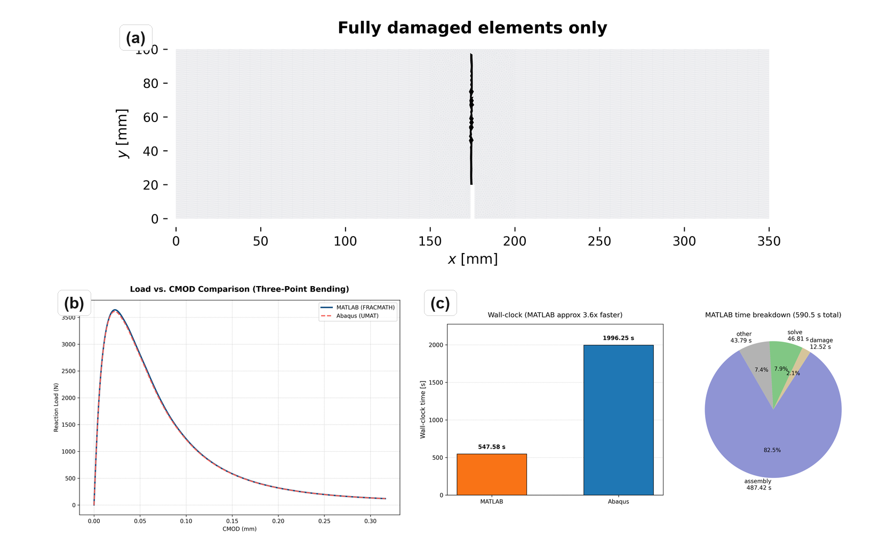
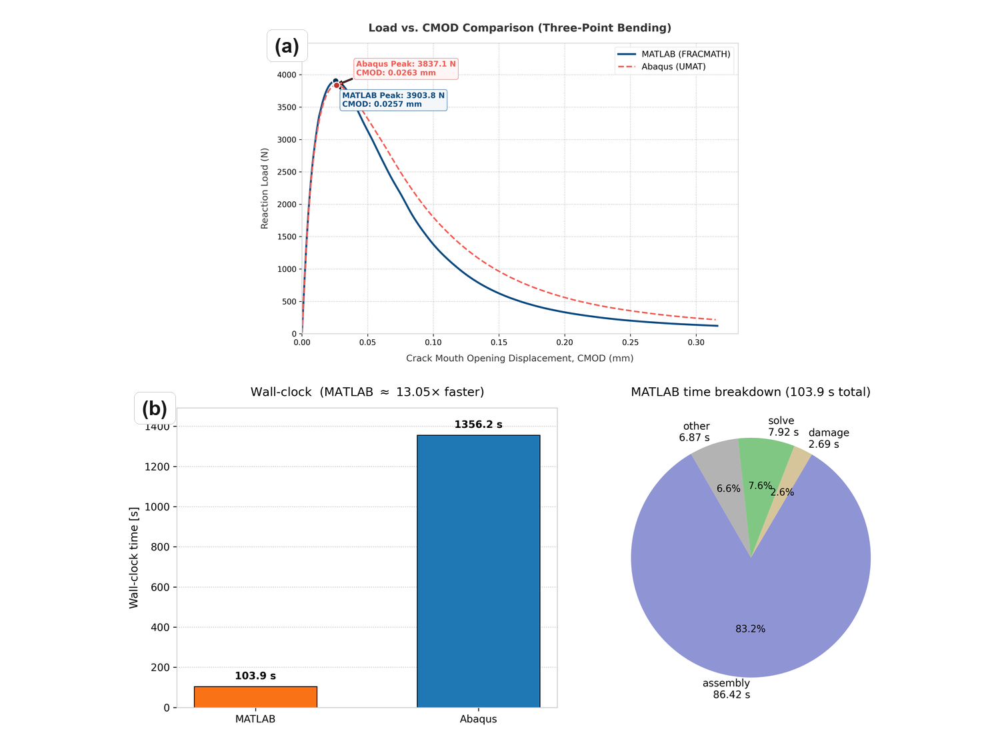
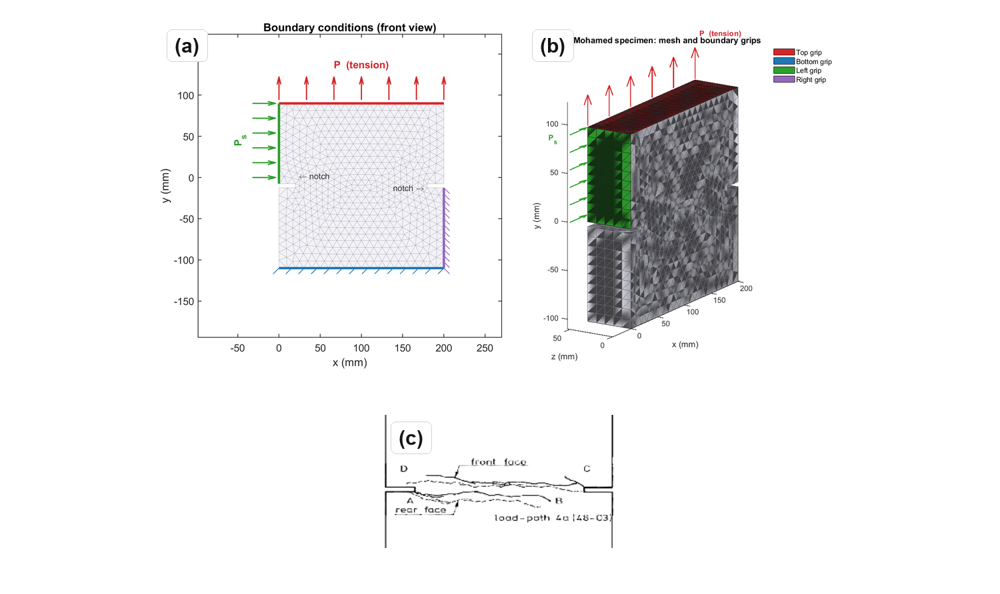
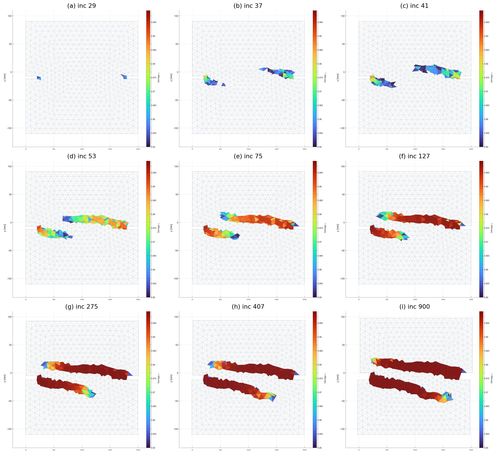
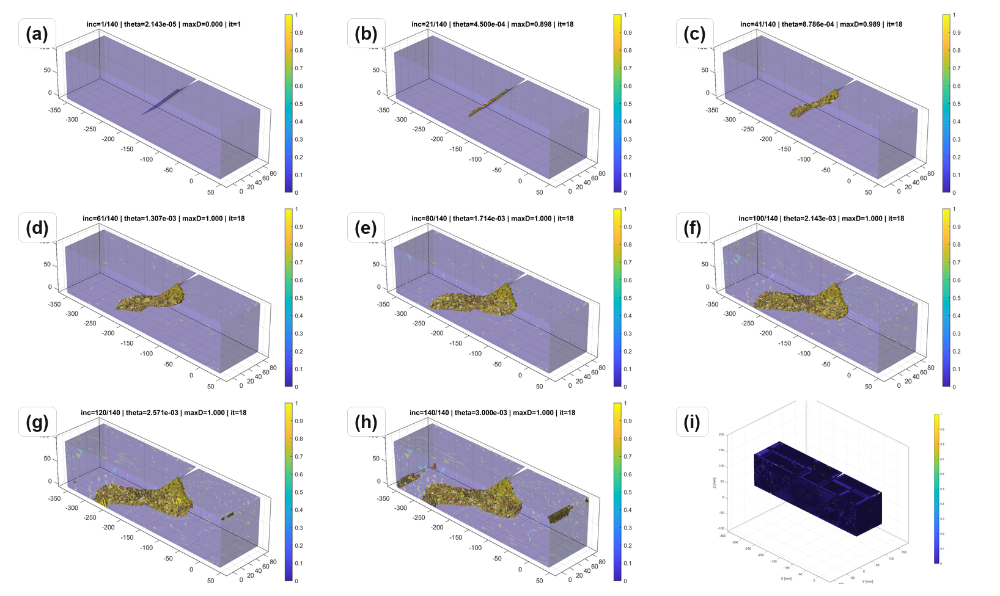

# Summary

`FRACMATH` is an open-source MATLAB framework for finite-element simulation of crack-band-regularized continuum damage mechanics (CDM) in quasi-brittle materials. The code uses a scalar isotropic damage variable, the modified von Mises equivalent strain [@deVree], exponential softening, and Oliver's direction-dependent projected crack-band length [@bazant_oh; @oliver1989]. It keeps the solver, plotting, and constitutive update inside MATLAB, with no MATLAB executable (MEX) files, compiled extensions, or separate build system.

The package includes a two-dimensional (2D) notched three-point bending (3PB) benchmark checked against Abaqus/Standard through an Oliver-matched user material subroutine (UMAT), plus two three-dimensional (3D) MATLAB demonstrations: the Nooru-Mohamed mixed-mode test and Brokenshire's notched beam torsion test. The repository stores source code, input decks, results, plotting scripts, and a theory manual at <https://github.com/Jaykumar9033/FRACMATH> under the MIT license.

# Statement of need

MATLAB remains useful in engineering research because students already know its matrix syntax, plotting tools, debugger, profiler, and sparse linear algebra. This matters for fracture modeling, where a user often needs to inspect element-level strain histories, change a softening law, compare crack-band lengths, and immediately visualize the damage field. `FRACMATH` uses that accessibility to provide a transparent CDM reference implementation rather than a general-purpose finite-element platform.

# State of the field

Open-source finite-element tools already cover many research needs, including OOFEM in C++ [@oofem], FEniCS for Python/C++ workflows [@fenics], Akantu for high-performance fracture simulations [@akantu], and CALFEM as a MATLAB teaching toolbox [@calfem]. These projects are valuable, but extending them for a new damage formulation can require learning a larger architecture, templated interface, wrapper layer, or compiled user-material workflow. Commercial tools such as Abaqus/Standard are also powerful, but custom CDM models generally require user-material subroutines, such as UMAT for Abaqus/Standard or VUMAT for Abaqus/Explicit, plus careful state-variable handling [@abaqus].

The closest recent Journal of Open Source Software (JOSS) comparison is `Parallel-CDM` by Eldababy et al. [@parallelcdm], which provides a MATLAB implementation of 2D local and nonlocal CDM with parallel assembly. `FRACMATH` is complementary: its emphasis is direction-dependent Oliver crack-band scaling, the same bandwidth formula in MATLAB and Abaqus, a direct UMAT cross-check on an identical 3PB mesh, and reuse of the scalar damage routine for 3D mixed-mode and torsion-driven crack paths.

# Software design

The material model follows standard scalar CDM, where damage variables and equivalent-strain histories are used to represent stiffness degradation in quasi-brittle fracture [@deVree; @bazant_planas]. Damage degrades the undamaged stiffness as

\begin{equation}
  \boldsymbol{\sigma} = (1-\omega)\mathbb{C}_0:\boldsymbol{\varepsilon},
  \label{eq:stress}
\end{equation}

where $\omega\in[0,1]$ is the damage variable. A history variable stores the maximum equivalent strain so damage cannot heal. Exponential softening is scaled element by element so the dissipated fracture energy matches $G_F$ after crack-band regularization [@bazant_oh]. Instead of using a fixed mesh length, `FRACMATH` computes Oliver's projected characteristic length from the element geometry and the current maximum-principal-strain direction [@oliver1989]. For a three-node triangular finite element (T3),

\begin{equation}
  h(\mathbf{n}) =
  \frac{2}{\sum_{a=1}^{3}|\nabla N_a \cdot \mathbf{n}|}.
  \label{eq:oliver-t3}
\end{equation}

The same idea is used for tetrahedra in 3D. In the Abaqus comparison, a preprocessing script writes the T3 shape-function gradients to `oliver_t3_gradN.dat`; the UMAT then recomputes Equation \ref{eq:oliver-t3} from the current principal strain direction. This avoids using Abaqus's built-in characteristic element length variable, `CELENT`, as a fixed crack-band length and keeps the regularization consistent with Oliver's characteristic-length construction [@oliver1989].

The quasistatic solver uses displacement control with a fixed-secant modified Newton iteration in each increment. The secant stiffness is assembled and factored once, displacement residuals are iterated with that fixed matrix, and damage is updated after the displacement solve. Element strains, equivalent strain, history variables, damage, and crack-band lengths are updated with vectorized MATLAB operations, including `pagemtimes`; sparse linear systems use MATLAB's backslash interface, which dispatches to UMFPACK [@umfpack]. This design favors readable vectorized kernels, direct plotting, and reviewer-side inspection over a larger compiled framework.

For the Abaqus comparison, `FRACMATH` includes the input deck, the Fortran UMAT, the Oliver-gradient table generator, and extraction scripts for load-CMOD curves, where CMOD is crack-mouth-opening displacement, and damage fields. The MATLAB and Abaqus paths therefore share the same mesh, boundary conditions, fracture energy, tensile strength, and crack-band bandwidth formula. Differences in the plotted response are primarily solver and implementation differences, not changes in the continuum model.

# Benchmarks

The main quantitative benchmark is the Gregoire notched 3PB beam [@gregoire2013], modeled with the same refined mesh, material constants, loading, scalar damage law, and Oliver crack-band formula in MATLAB and Abaqus. The 2D mesh uses Abaqus CPS3 elements, where CPS3 denotes a three-node plane-stress triangular element. MATLAB predicts a peak load of 3.63982 kN at CMOD 0.022811 mm; Abaqus predicts 3.60913 kN at CMOD 0.022485 mm. Both simulations localize damage upward from the notch, which is the expected opening-mode (mode-I) crack path for this geometry [@gregoire2013]. The Abaqus UMAT independently evaluates the same damage law and Oliver bandwidth inside a commercial finite-element environment [@abaqus; @oliver1989].

The stored timing logs for this benchmark run report MATLAB R2024a using one thread and Abaqus/Standard 2023 using four threads. The MATLAB solver wall-clock time was 547.58 s, while the Abaqus submit-to-completion time was 1996.25 s. MATLAB time was dominated by stiffness assembly, not by the sparse solve. The timing should not be read as a universal speed claim, because solver settings, output requests, hardware, and Abaqus licensing can all change wall-clock time.

| Quantity | MATLAB | Abaqus + UMAT |
|---|---:|---:|
| Peak load (N) | 3639.82 | 3609.13 |
| CMOD at peak (mm) | 0.022811 | 0.022485 |
| Solver/submit wall-clock (s) | 547.58 | 1996.25 |
| End-to-end/internal time (s) | 590.54 | 1968.00 |

Table: 2D 3PB comparison using the same mesh, material law, and Oliver T3 crack-band bandwidth. \label{tab:abqcompare}

{ width=100% }

{ width=94% }

The Nooru-Mohamed benchmark checks mixed-mode 3D cracking in a double-edge-notched concrete panel under combined tension and shear [@nooru1992]. The same scalar CDM routine uses four-node linear tetrahedral (TET4) elements and Oliver crack-band scaling [@oliver1989]. The simulated damage bands initiate at the two notch tips and coalesce across the ligament, matching the qualitative experimental crack-path pattern.

{ width=100% }

This example is included because mixed-mode response is a common failure point for simplified fracture implementations. In the simulation, the crack-band direction changes as the principal strain field evolves, so the projected bandwidth is recomputed rather than assigned from a constant element size. The resulting localization band does not remain a straight mode-I notch extension; it bends across the ligament in the same qualitative direction as the reported experimental crack path.

{ width=96% }

Brokenshire's torsion benchmark tests whether the same formulation can recover a curved 3D fracture surface in a notched plain concrete beam [@jefferson_torsion]. The model uses a prescribed twist, TET4 elements, and the same damage update. The computed band nucleates at the notch front and rotates toward the loaded corner, consistent with the experimentally recovered fracture surface.

![Brokenshire torsion benchmark: geometry and experimental fractured specimen from Jefferson et al. [@jefferson_torsion]. \label{fig:b3-mesh}](images/fig_b3_mesh.png){ width=88% }

The torsion case is deliberately different from the 3PB validation: it contains out-of-plane cracking, a nonuniform stress state, and a visibly curved fracture surface. The 3D examples are intended as qualitative crack-path demonstrations; only the 2D 3PB case is quantitatively cross-checked against Abaqus.

{ width=96% }

# Research impact statement

`FRACMATH` provides a reproducible reference workflow for CDM and crack-band studies. Its immediate scholarly value is the paired MATLAB/Abaqus 3PB benchmark, where the MATLAB solver is cross-checked against an independent Abaqus UMAT on the same mesh and material data. The repository also provides benchmark inputs, stored output data, plotting scripts, and 2D and 3D examples that can be reused for teaching, method comparison, and future extensions of crack-band regularization.

# Software availability

The repository contains MATLAB source code, Abaqus UMAT files, benchmark input decks, plotting scripts, updated results, a theory manual, `LICENSE`, `CITATION.cff`, `CONTRIBUTING.md`, and reproducibility instructions. Reviewers can run the smoke tests from the repository root with `matlab -batch "addpath('tests'); run_smoke_checks"`. The test suite has been checked on MATLAB R2022a, R2023a, and R2024a across Linux, macOS, and Windows. A release archive digital object identifier (DOI) should be added before final JOSS acceptance.

# Limitations

`FRACMATH` is quasistatic and does not include inertia, rate effects, contact, plasticity, or unilateral crack closure. Damage is isotropic and scalar, so anisotropic stiffness recovery and cyclic loading are outside the current scope. Crack-band scaling controls mesh-objective energy dissipation but does not introduce a physical material length scale.

# AI usage disclosure

Generative AI tools were used to assist with manuscript wording and formatting. They were not used as an authority for scientific claims. The authors reviewed and verified the equations, numerical results, figures, and references.

# Acknowledgements

The authors acknowledge support from the National Aeronautics and Space Administration, the New Mexico Space Grant Consortium under grant 80NSSC22M0044, and the New Mexico Department of Finance and Administration under grant ZI5044-MG25-109. The opinions and conclusions are those of the authors and do not necessarily reflect the views of the sponsors.

# References
