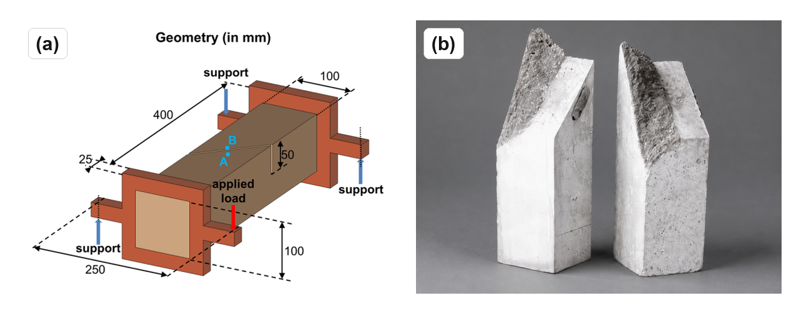

# Summary

`FRACMATH` is an open-source MATLAB framework for finite-element simulation of crack-band-regularized continuum damage mechanics (CDM) in quasi-brittle materials. The code uses a scalar isotropic damage variable, the modified von Mises equivalent strain [@deVree], exponential softening, and Oliver's direction-dependent projected crack-band length [@bazant_oh; @oliver1989]. It is written as a compact MATLAB workflow so users can inspect the model, change the constitutive law, plot results, and debug simulations without a compiled extension layer.

The package includes a two-dimensional notched three-point bending (3PB) benchmark checked against Abaqus/Standard through an Oliver-matched UMAT, plus two three-dimensional MATLAB benchmarks: the Nooru-Mohamed mixed-mode test and Brokenshire's notched beam torsion test. The repository also stores plotting scripts, benchmark inputs, comparison tables, and the figures used in this paper, so readers can trace the numerical results back to the code paths that produced them. Source code, input decks, results, and a theory manual are available at <https://github.com/Jaykumar9033/FRACMATH> under the MIT license.

# Statement of need

Open-source finite-element tools already cover many research needs. Examples include OOFEM in C++ [@oofem], FEniCS for Python/C++ finite-element workflows [@fenics], Akantu for high-performance fracture simulations [@akantu], and CALFEM as a MATLAB teaching toolbox [@calfem]. These projects are valuable, but using or extending them for a new damage formulation often requires learning a larger architecture, build system, or compiled user-material interface. Commercial workflows such as Abaqus/Standard are also powerful, but custom CDM models generally require UMAT/VUMAT development and careful state-variable handling [@abaqus].

MATLAB remains attractive in engineering research because it is easy to use: students already know its matrix syntax, plotting tools, debugger, profiler, and sparse linear algebra. This matters for fracture modeling, where a user often needs to inspect element-level strain histories, change a softening law, compare crack-band lengths, and immediately visualize the damage field. `FRACMATH` uses that accessibility to provide a transparent CDM reference implementation rather than a large general-purpose finite-element platform. It avoids MEX files and external compiled dependencies for the MATLAB solver, which keeps installation simple and makes the implementation suitable for teaching, prototyping, and reviewer-side reproduction.

The closest JOSS work is `Parallel-CDM` by Eldababy et al. [@parallelcdm], which provides a MATLAB implementation of 2D local and nonlocal CDM with parallel assembly. The JOSS continuum-damage-mechanics listing currently contains that single CDM-focused paper, making it the most relevant open-source comparison point for this submission. `FRACMATH` is complementary rather than a replacement. Its contribution is not a new parallel assembly framework. Instead, the novelty is the direction-dependent Oliver crack-band scaling used consistently in MATLAB and Abaqus, the direct UMAT cross-check on an identical 3PB mesh, and the extension of the same scalar damage routine from 2D mode-I fracture to 3D mixed-mode and torsion-driven crack paths. This combination gives users a short MATLAB code base for understanding the regularization procedure and a commercial-code comparison for checking the same constitutive assumptions.

# Method

The material model follows standard scalar CDM. Damage degrades the undamaged stiffness as

\begin{equation}
  \boldsymbol{\sigma} = (1-\omega)\mathbb{C}_0:\boldsymbol{\varepsilon},
  \label{eq:stress}
\end{equation}

where $\omega\in[0,1]$ is the damage variable. A history variable stores the maximum equivalent strain so damage cannot heal. Exponential softening is scaled element by element so the dissipated fracture energy matches $G_F$ after crack-band regularization [@bazant_oh]. Instead of using a fixed mesh length, `FRACMATH` computes Oliver's projected characteristic length from the element geometry and the current maximum-principal-strain direction [@oliver1989]. For a three-node triangle,

\begin{equation}
  h(\mathbf{n}) =
  \frac{2}{\sum_{a=1}^{3}|\nabla N_a \cdot \mathbf{n}|}.
  \label{eq:oliver-t3}
\end{equation}

The same idea is used for tetrahedra in 3D. In the Abaqus comparison, a preprocessing script writes the T3 shape-function gradients to `oliver_t3_gradN.dat`; the UMAT then recomputes Equation \ref{eq:oliver-t3} from the current principal strain direction. This avoids using Abaqus `CELENT` as a fixed crack-band length.

The quasistatic solver uses displacement control and a modified Newton--Raphson loop. At each load step, a secant stiffness is assembled and factored once. Element strains, equivalent strain, history variables, damage, and crack-band lengths are updated with vectorized MATLAB operations, while linear systems use MATLAB's sparse backslash interface, which dispatches to UMFPACK [@umfpack]. The code separates mesh data, material data, state variables, the constitutive update, and postprocessing outputs, but keeps these pieces in plain MATLAB functions. This design is intentional: the routines are short enough for a user to read, yet structured enough to run the same benchmark repeatedly while changing mesh density, softening parameters, or output thresholds.

For the Abaqus comparison, `FRACMATH` includes the input deck, the Fortran UMAT, the Oliver-gradient table generator, and extraction scripts for load-CMOD and damage fields. The MATLAB and Abaqus paths therefore share the same mesh, boundary conditions, fracture energy, tensile strength, and crack-band bandwidth formula. Differences in the plotted response are primarily solver and implementation differences, not changes in the continuum model.

# Benchmarks

The main benchmark is the Gregoire notched 3PB beam [@gregoire2013], with $D=100$ mm, $a/D=0.2$, span $S=250$ mm, thickness 50 mm, and a refined CPS3 triangular mesh. The final mesh has 14,268 elements, 7,319 nodes, and 14,638 in-plane displacement degrees of freedom. MATLAB and Abaqus use the same mesh, material constants, loading, scalar damage model, and Oliver crack-band formula.

The updated results show close agreement in peak response and crack localization. MATLAB predicts a peak load of 3.64 kN at CMOD 0.0228 mm; Abaqus predicts 3.61 kN at CMOD 0.0225 mm. The ratio of the peak loads is 1.009, and the ratio of CMOD values at peak is 1.014. Both simulations localize damage upward from the notch, which is the expected mode-I crack path for this geometry. The agreement is important because the Abaqus UMAT independently evaluates the same damage law and Oliver bandwidth inside a commercial finite-element environment.

On the test workstation, MATLAB used one thread and Abaqus used four threads. The MATLAB solver wall-clock time was 547.58 s, while the Abaqus submit-to-completion time was 1996.25 s. MATLAB time was dominated by stiffness assembly, not by the sparse solve. The timing should not be read as a universal speed claim, because solver settings, output requests, hardware, and Abaqus licensing can all change wall-clock time. It does show that a readable MATLAB implementation can still be practical for research-scale 2D crack-band studies.

| Quantity | MATLAB | Abaqus + UMAT | Ratio |
|---|---:|---:|---:|
| Peak load (kN) | 3.64 | 3.61 | 1.009 |
| CMOD at peak (mm) | 0.0228 | 0.0225 | 1.014 |
| Solver wall-clock (s) | 547.58 | 1996.25 | 0.274 |

Table: Updated 2D 3PB comparison using the same mesh, material law, and Oliver T3 crack-band bandwidth. \label{tab:abqcompare}

{ width=92% }

The Nooru-Mohamed benchmark checks mixed-mode 3D cracking in a double-edge-notched concrete panel loaded by combined tension and shear [@nooru1992]. The same scalar CDM routine is used with TET4 elements and Oliver crack-band scaling. The simulated damage bands initiate at the two notch tips and coalesce across the ligament, matching the experimental crack-path pattern.

This example is included because mixed-mode response is a common failure point for simplified fracture implementations. The loading combines a horizontal prescribed displacement, a vertical prescribed displacement, and fixed supports on the opposite edges. In the simulation, the crack-band direction changes as the principal strain field evolves, so the projected bandwidth is recomputed rather than assigned from a constant element size. The resulting band does not remain a straight mode-I notch extension; it bends across the ligament in the same qualitative direction as the reported experimental crack path.

{ width=100% }

{ width=100% }

Brokenshire's torsion benchmark tests whether the same formulation can recover a curved 3D fracture surface [@jefferson_torsion]. The model uses a prescribed twist, TET4 elements, and the same damage update. The computed band nucleates at the notch front and rotates toward the loaded corner, consistent with the experimentally recovered fracture surface.

{ width=88% }

The torsion case is deliberately different from the 3PB validation. It contains out-of-plane cracking, a nonuniform stress state, and a visibly curved fracture surface. It therefore checks whether the implementation remains useful beyond a single 2D benchmark. The code stores intermediate damage snapshots, allowing users to inspect how the localized zone grows rather than seeing only the final fully damaged band.

{ width=88% }

# Software availability

The repository contains MATLAB source code, Abaqus UMAT files, benchmark input decks, plotting scripts, updated results, and a theory manual. MATLAB scripts can be run directly from the benchmark folders, and the plotting scripts regenerate the paper figures from stored CSV files and damage fields. The test suite has been checked on MATLAB R2022a, R2023a, and R2024a across Linux, macOS, and Windows.

<!-- TODO before final JOSS submission: make a tagged release and add the software archive DOI from Zenodo or another supported archive. -->

# Limitations

`FRACMATH` is quasistatic and does not include inertia, rate effects, contact, plasticity, or unilateral crack closure. Damage is isotropic and scalar, so anisotropic stiffness recovery and cyclic loading are outside the current scope. Crack-band scaling controls mesh-objective energy dissipation but does not introduce a physical material length scale.

# AI usage disclosure

Generative AI tools were used to assist with converting and shortening the manuscript, checking wording, and formatting the JOSS paper. The scientific claims, equations, code behavior, numerical results, figures, and references were reviewed and remain the responsibility of the authors.

# Acknowledgements

The authors acknowledge support from the National Aeronautics and Space Administration, the New Mexico Space Grant Consortium under grant 80NSSC22M0044, and the New Mexico Department of Finance and Administration under grant ZI5044-MG25-109. The opinions and conclusions are those of the authors and do not necessarily reflect the views of the sponsors.

# References
