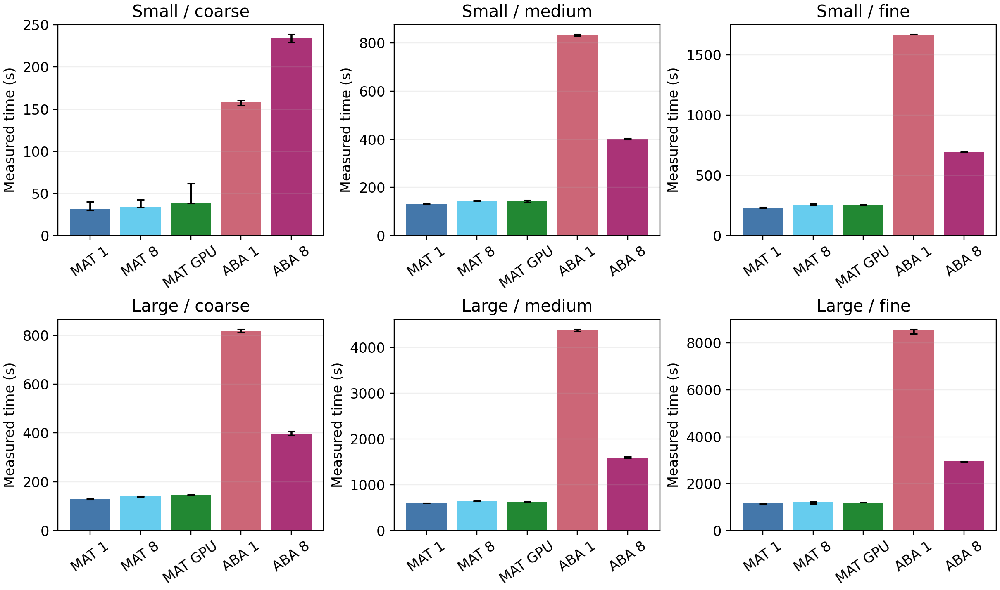
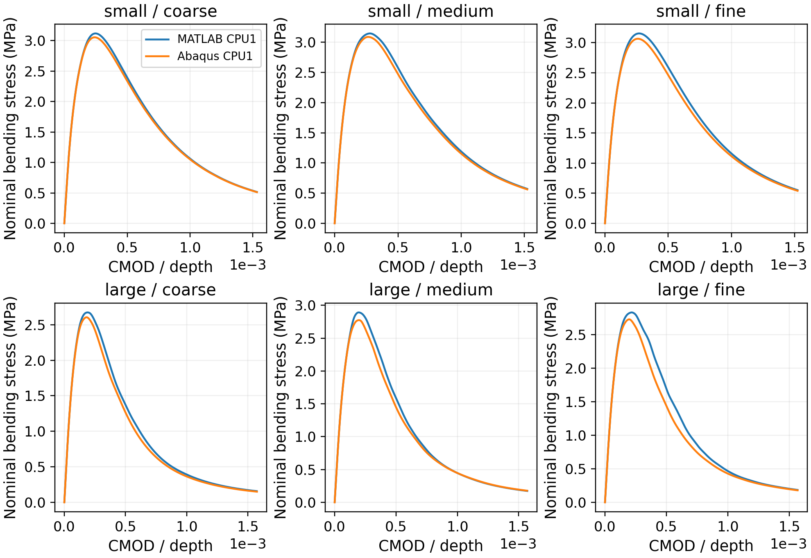

# Size, mesh, and hardware comparison

The study has 30 configurations: two geometrically similar specimens, three absolute mesh seeds, and five hardware settings. All configurations for a given size/mesh use the same Abaqus-exported CPS3 connectivity and boundary sets. Element and node file SHA256 checks reject a different rebuilt mesh.

| Setting | Small | Large |
|---|---:|---:|
| Depth (mm) | 100 | 200 |
| Length (mm) | 350 | 700 |
| Support span (mm) | 250 | 500 |
| Thickness (mm) | 50 | 100 |
| Notch depth (mm) | 20 | 40 |
| Notch width (mm) | 2.5 | 5 |
| Final prescribed displacement (mm) | -0.1 | -0.2 |

All dimensions and the displacement scale by two. This holds final displacement/depth fixed, while concrete fracture energy introduces a physical size effect; the two specimens need not have scaled-identical response curves.

Global/notch seeds are 12.5/2.5, 6.25/1.25, and 4.6875/0.9375 mm for coarse, medium, and fine. The absolute seeds stay fixed between specimen sizes, so the large specimen has more elements. Geometric boundary partitions keep supports and loading-strip locations fixed as mesh resolution changes. Thickness scales consistently in MATLAB and Abaqus.

## Five computing configurations

1. MATLAB CPU, one computational thread.
2. MATLAB CPU, eight-thread limit for supported numerical libraries. This is library multithreading, not eight independent simulation workers.
3. MATLAB hybrid GPU, double precision: resident element stiffness, strain operators and gradients; GPU element-stiffness values and a fused scalar constitutive damage kernel compiled by `gpuArray.arrayfun`; CPU sparse assembly, factorization and equilibrium solves. Transfers and GPU synchronization are included in the timed operations. This is not a GPU sparse solver.
4. Abaqus/Standard CPU, one thread.
5. Abaqus/Standard CPU, eight threads in SMP mode. The UMAT gradient table is eagerly initialized in UEXTERNALDB at the beginning of analysis, before parallel material calls. Its arrays are read-only during UMAT calls. Missing element gradients terminate a material call instead of silently using CELENT.

The workstation uses MATLAB R2024b Update 6, Abaqus/Standard 2024, Intel ifx, an Intel Core i9-13900, and NVIDIA RTX A2000 12GB (compute capability 8.6). The GPU's double-precision throughput is much lower than single precision; acceleration is measured rather than assumed. Other desktop applications remain open, so this is a workstation observation, not a dedicated-machine benchmark.

## Reproduction and acceptance

```powershell
python softwarex/run_scaling_study.py --pilot --workspace C:/runs/scaling_pilot
python softwarex/analyze_scaling_study.py --workspace C:/runs/scaling_pilot --output C:/runs/scaling_pilot/analysis
python softwarex/run_scaling_study.py --workspace C:/runs/scaling
python softwarex/analyze_scaling_study.py --workspace C:/runs/scaling --output C:/runs/scaling/analysis
```

Licensed MATLAB with Parallel Computing Toolbox, a CUDA-compatible GPU, and licensed Abaqus with a configured Fortran compiler are required. Build and solve processes run sequentially. Each structural solve starts in a fresh process. A manifest pins source hashes, parameters, and computing settings; a different source or step count requires a new workspace. Completed jobs are skipped on restart. The pilot uses 200 increments to -0.03 mm on the small coarse mesh. It is a correctness check, not a replacement for the 2,000-increment study.

MATLAB uses 2,000 fixed increments; Abaqus uses maximum increments of 1/2,000 with adaptive cutbacks. All MATLAB old-damage solves must converge, and complete finite histories are required. Within MATLAB, the maximum load-history difference from CPU1 must be <=0.1% of CPU1 peak, and maximum absolute final-damage difference must be <=1e-4. Within Abaqus, the peak difference and maximum curve difference on a common monotone CMOD grid must be <=0.1% of CPU1 peak; accepted-increment counts and adaptive paths are also reported. These checks assess hardware consistency; MATLAB's sequential post-damage residual is preserved and reported, not confused with fully coupled equilibrium.

Solver wall time, component scopes, process-launch time, response peaks, nominal bending stress $3.75P/(bD)$, residuals and memory records accompany the results. MATLAB loop time excludes precomputation and output writing; Abaqus analysis wall time includes its analysis/output work. Launch-to-exit costs additionally include initialization and (for Abaqus) model construction. Within-program speed ratios are conditional on the response checks. Cross-program timings are descriptive because the equilibrium algorithms differ. Three sequential observations per case describe the observed timing range, without establishing population confidence intervals. Abaqus material and stiffness-assembly timers are not inferred from its unallocated remainder.

The 3D numerical mesh-consistency study and the 10,000-step Figure 1 benchmark are separate studies. The hardware comparison uses its own stated meshes and increment controls.

MATLAB working set is the process-reported peak; Abaqus memory is the maximum sampled `standard.exe` working set at one-second intervals, which is a lower bound on its true peak.

No driver/kernel cache flush is performed between launches. Fresh processes do not imply empty operating-system or GPU compilation caches. Pilot timings establish correctness and are not used as main-study speed estimates.

Abaqus default PRESELECT field/history requests are removed. The only field output is SDV every 100 accepted increments (nominally 20 outputs for 2,000 increments); load and CMOD histories are written every accepted increment. Adaptive cutbacks can increase the number of accepted increments and field frames. The pilot uses a field frequency of 10. This prevents unintended per-increment field output from dominating storage and the timing scope.

The timing-file MATLAB `End-to-end` field describes the load loop including visualization; it excludes initialization, precomputation, and output writing. The independently recorded launch-to-exit value covers the process lifetime.
## Inspecting the archived evidence

The six size/mesh archives preserve common meshes, input decks, response histories, MATLAB states, solver diagnostics, logs, and completion metadata. ODBs and compiled Abaqus binaries are excluded. SHA256 values verify both archives and extracted members. To inspect the archived results without launching simulations:

```powershell
python softwarex/archive_scaling_study.py extract --package softwarex/reproducibility/scaling_study --workspace C:/runs/scaling_archive
python softwarex/analyze_scaling_study.py --workspace C:/runs/scaling_archive --output C:/runs/scaling_archive/analysis
```

To regenerate simulations, use a separate empty workspace with `run_scaling_study.py`; extracting the archive preserves completion markers and consequently skips existing solves.

### Localization and iteration limits

The large specimen's medium and fine meshes use an equilibrium-iteration limit of 80 and an increment-attempt limit of 12 in both Abaqus thread configurations. Other cases use default limits. Force and displacement convergence tolerances retain their defaults; no stabilization is added. A default-control medium-mesh attempt stops at increment 658 during localization and is preserved under `failed_attempts`, excluded from completed-job timing. The extended controls allow the secant tangent more iterations. Each computing comparison holds these controls fixed within its size/mesh pair.

## Measured results

All 30 histories complete and pass the declared hardware-response checks. Maximum MATLAB load-history difference from CPU1 is 1.76e-11 of peak load; maximum absolute final-damage difference is 1.34e-9. Abaqus CPU1/CPU8 curves agree at exported CSV precision, with identical increments, cutbacks and solver-pass counts within every pair.

Times below are medians of three sequential workstation observations per configuration (90 runs). The third observation reverses the computing-configuration order. Minimum and maximum observed times are retained in the timing CSV and figure; they are not confidence intervals. MATLAB covers its load loop; Abaqus covers analysis and output. They do not establish a cross-program speed ranking.

| Size | Mesh | DOFs | MATLAB CPU1 (s) | MATLAB CPU8 (s) | MATLAB hybrid GPU (s) | Abaqus CPU1 (s) | Abaqus CPU8 (s) |
|---|---|---:|---:|---:|---:|---:|---:|
| small | coarse | 3,772 | 31.3 | 33.8 | 38.5 | 158 | 234 |
| small | medium | 14,686 | 131.2 | 144.0 | 146.1 | 832 | 403 |
| small | fine | 25,534 | 232.3 | 251.8 | 255.0 | 1667 | 691 |
| large | coarse | 14,686 | 127.6 | 140.0 | 147.0 | 819 | 398 |
| large | medium | 56,954 | 598.9 | 639.6 | 626.4 | 4380 | 1586 |
| large | fine | 101,088 | 1155.5 | 1206.0 | 1193.9 | 8548 | 2947 |

MATLAB CPU8 and the hybrid GPU backend are slower than CPU1 for all six median comparisons. CPU1 sparse factorization accounts for 67-76% of the load loop. The hybrid GPU retains that CPU factorization and includes data transfers in its element/damage scopes. These data support a functional GPU backend, with no GPU speedup on this workstation. Abaqus CPU8 is slower on the smallest case and gives within-program speed ratios of 2.06-2.90 on the remaining cases. On the largest mesh, Abaqus takes 8,548/2,947 s (CPU1/CPU8), with 2,003 accepted increments and 8,297 solver passes in both configurations.

MATLAB CPU1 peaks are 1.87-4.24% above Abaqus CPU1 peaks across these six cases. Different equilibrium algorithms and residuals qualify this comparison. Abaqus CPU1 summed sparse-solver elapsed times account for 9.5-14.4% of analysis wall time. The remaining time is unallocated; it is not labeled material or assembly time. Original measured ODB sizes accompany the live-run summary; an archive replay without ODBs reports that size as unavailable while retaining all other diagnostics.





## Repeated observations

All saved MATLAB numerical arrays and Abaqus response CSVs are identical across the three observations within each setting. Abaqus accepted-increment and solver-pass counts are also identical. Timings vary and are not numerical outputs to reproduce exactly.

```powershell
python softwarex/run_timing_repeats.py --baseline C:/runs/scaling_study --workspace C:/runs/timing_repeats
python softwarex/plot_timing_repeats.py --summary C:/runs/timing_repeats/analysis/summary.json --baseline C:/runs/scaling_study/analysis/summary.json --output C:/runs/timing_repeats/analysis
```

## Separate UMAT and native assembly diagnostics

The companion [phase measurement archive](reproducibility/abaqus_phase_timing/README.md) contains a direct serial UMAT call timer and a native-only VTune profile. Both use the matched small/coarse mesh and finish the same response path. These optional archived diagnostics are not reported in the current manuscript and do not enter the 90 archived timing observations. Clock overhead and sampling scopes prevent a complete material/assembly wall-time partition.

## Current manuscript presentation

The manuscript includes the five-configuration timing bar chart from igures/scaling_timings.pdf, covering both specimen sizes and all three meshes. Its caption identifies medians of three observations, observed minimum--maximum ranges, and the different MATLAB load-loop and Abaqus analysis/output scopes. The matched fixed-increment component table remains a separate comparison.

